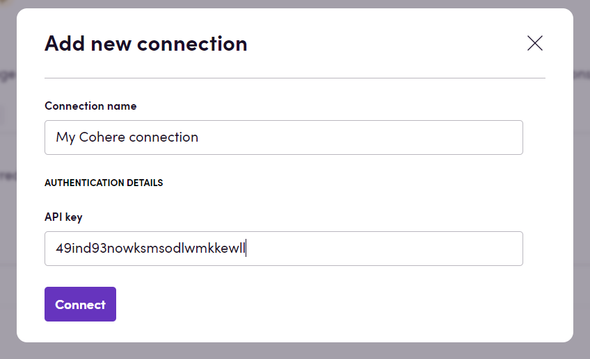

# Blackbird.io Cohere

Blackbird is the new automation backbone for the language technology industry. Blackbird provides enterprise-scale automation and orchestration with a simple no-code/low-code platform. Blackbird enables ambitious organizations to identify, vet and automate as many processes as possible. Not just localization workflows, but any business and IT process. This repository represents an application that is deployable on Blackbird and usable inside the workflow editor.

## Introduction

<!-- begin docs -->

Cohere is an artificial intelligence company that specializes on large language models (LLMs) trained on massive amounts of text data. These LLMs help businesses build software that can search, understand, generate and summarize text.

## Before setting up

Before you can connect you need to make sure that:

- You have a Cohere account.
- You have an API key for your Cohere account. Learn more about Cohere's API keys [here](https://docs.cohere.com/reference/create-an-api-key%20).

## Connecting

1. Navigate to apps and search for Cohere. If you cannot find Cohere then click _Add App_ in the top right corner, select Cohere and add the app to your Blackbird environment.
2. Click _Add Connection_.
3. Name your connection for future reference e.g. 'My Cohere connection'.
4. Fill in the API key for your Cohere account.
7. Click _Connect_.

## Actions

- **Analyze text** Analyze text to retrieve information about its style, mood and tone.
- **Calculate similarity of two texts** Calculate the similarity of texts provided. The result of this action is a percentage similarity score. The higher the score, the more similar the texts are.
- **Classify text** Classify text input. This action requires examples and their corresponding labels to be specified. Each unique label requires at least two examples associated with it.
- **Classify text with examples as a file** Classify text input. This action requires a csv file with examples and their corresponding labels. Each file's line should have the form 'example, label'. Each unique label requires at least two examples associated with it.
- **Detect language** Detect the language of text provided.
- **Detect locale** Detect locale of the text provided.
- **Edit text** Edit the input text given an instruction prompt (e.g. make it more concise or make it more friendly).
- **Extract entity from text** Extract a piece of information from text. Provide entity that you want to extract from a text (e.g. product title).
- **Generate embedding** Generate text embedding. An embedding is a list of floating point numbers that captures semantic information about the text that it represents.
- **Generate text** Generate realistic text conditioned on a given input.
- **Perform grammar and spelling check** Perform a grammar and spelling check of the text provided.
- **Rerank texts** This action takes in a query and a list of texts and produces an ordered list with each text assigned a relevance score.
- **Rerank texts provided in a file** This action takes in a query and a txt file with list of texts and produces a text combined from most relevant texts. Each text in the file must start on a new line.
- **Reshape text** Reshape the text. Provide the information about target style, mood and tone.
- **Summarise text analyses** Summarise information about styles, moods and tones of different texts to find common patterns in styles, moods and tones.
- **Summarize text** Summarize the text provided.
- **Tokenize text** Tokenize text. Specify model to ensure that the tokenization uses the tokenizer used by specific model.

## Feedback

Do you want to use this app or do you have feedback on our implementation? Reach out to us using the [established channels](https://www.blackbird.io/) or create an issue.

<!-- end docs -->
